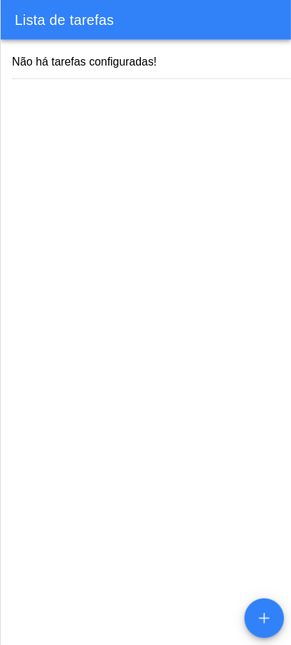
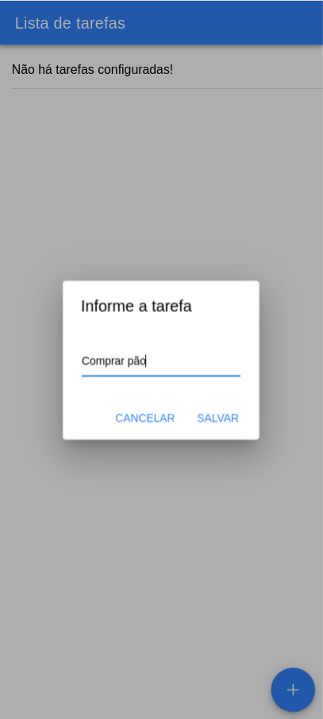
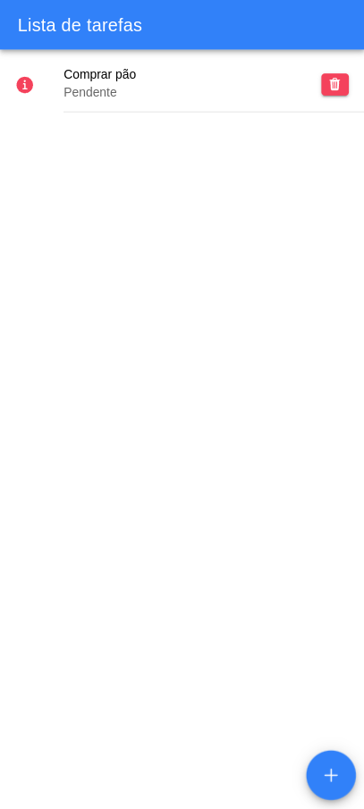
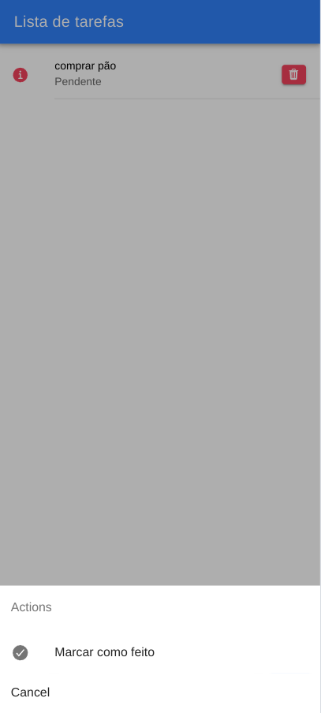
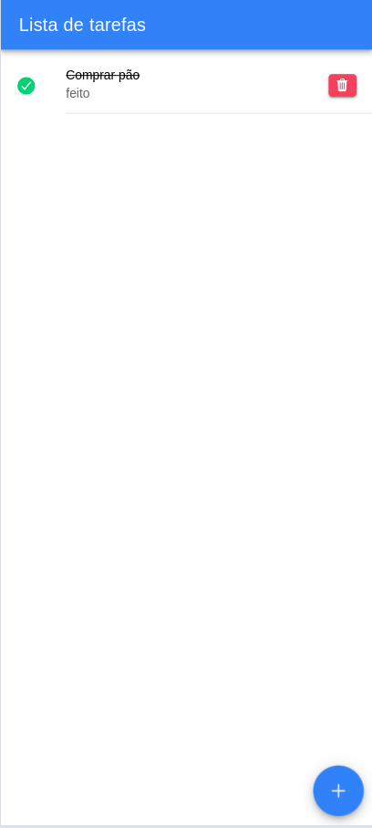

# Ionic to-do app

Este projeto se trata de um aplicativo multi-plataforma desenvolvido usando o framework ionic 7 e typescript, o aplicativo armazena local as tarefas não sendo necessario utilizar uma api externa, ou um banco de dados.

